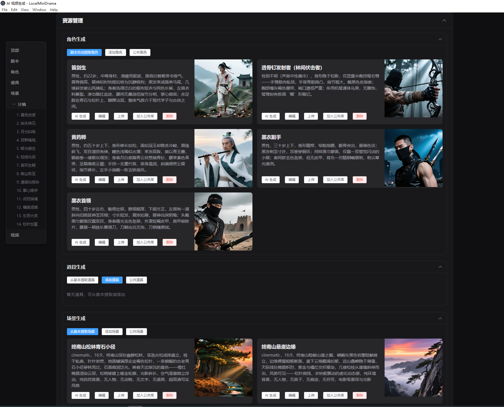
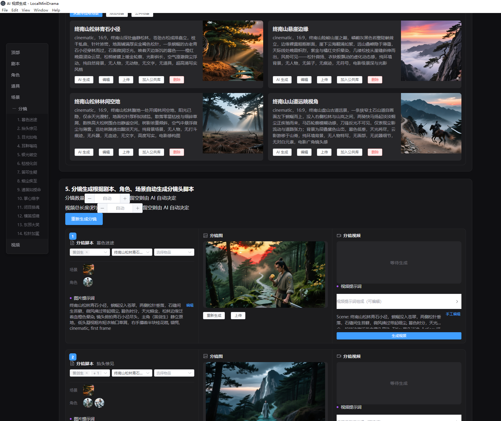

<div align="center">

# 🎬 DramaStudio

**本地 AI 短剧 & 漫剧生成工具 —— 下载即用，完全开源，数据不出本机**

*DramaStudio · AI-powered short drama creator*

[](../../releases)
[](LICENSE)
[](#)
[](#)
[](../../pulls)

**[English](docs/en.md) | 简体中文 | [作者故事](docs/story.md)**

[](https://github.com/liruiqing76/DramaStudio)

</div>

---

市面上 AI 短剧工具不少，但真正能做到**完整本地部署、数据自控、开箱即用**的并不多。  
本项目用纯 JavaScript 从零搭建，接入你自己的 AI API，打开即可生成完整 AI 短剧。

> ✅ 无订阅费 · ✅ 项目数据本地存储 · ✅ 支持多家 AI 服务商 · ✅ 完全开源可二次开发

> 📌 **关于数据流向**：项目工程、剧本、角色与分镜数据全部存储在本机 SQLite 与本地目录。
> 图片/视频/文本生成需要调用你自行配置的云端 AI 服务（Agnes / 通义 / MiniMax 等），
> 对应素材会发送至该服务商。

---

## 📸 界面预览

<div align="center">
  <br/>
  <sub>首页 · 项目卡片一览，亮色模式</sub>
</div>

<br/>

<table>
  <tr>
    <td align="center"><br/><sub>剧集管理 · 分集 + 资源库</sub></td>
    <td align="center"><br/><sub>分镜制作 · 图片 + 视频一键生成</sub></td>
  </tr>
  <tr>
    <td align="center"><br/><sub>角色生成 · AI 自动提取并生成角色形象图</sub></td>
    <td align="center"><br/><sub>分镜制作 · 专业视频参数（景别 / 运镜 / 灯光 / 景深）</sub></td>
  </tr>
  <tr>
    <td align="center" colspan="2"><br/><sub>场景库 · 一键「加入本集」，复用已有场景素材</sub></td>
  </tr>
</table>

---

## 🎬 生成效果

> 分镜连续性与角色外貌一致性是本工具的核心能力：同一剧集的多个分镜中，
> 主角形象、服装、整体风格保持稳定统一，依托分镜参考图传递机制与角色锚点约束实现。

<table>
  <tr>
    <td align="center"><br/><sub>连续分镜 · 角色形象与服装跨镜保持一致</sub></td>
  </tr>
</table>

> 💡 **当前版本视频生成聚焦三家主力模型**：**通义万相 WAN 3.0**、**MiniMax Hailuo-03**、**Agnes Video 2.5**，覆盖文生视频、图生视频、首尾帧、参考图等全链路模式。

---

## ✨ 核心功能

### 🔄 完整创作流程

| 步骤 | 功能 | 说明 |
|:----:|------|------|
| 1 | **故事生成** | 输入梗概 + 风格，AI 自动生成多集剧本 |
| 2 | **剧本编辑** | 分集管理，剧本文本可自由编辑 |
| 3 | **角色生成** | AI 提取角色列表，逐个生成角色形象图 |
| 4 | **场景生成** | 从剧本自动提取场景，生成场景背景图 |
| 5 | **道具生成** | 从剧本提取/手动添加道具，生成道具图 |
| 6 | **分镜生成** | 按集自动生成分镜脚本（含景别/运镜/台词） |
| 7 | **图片/视频生成** | 逐镜生成静帧图与视频片段 |
| 8 | **合成视频** | 所有分镜视频自动合成为完整剧集文件 |

### ⚡ 一键流水线

- **一键生成视频**：从角色图到最终合成视频，全程自动执行
- **补全并生成**：智能跳过已有内容，只补全缺失部分
- **失败自动重试**：每步最多重试 3 次，应对 429 限流等错误，不中断流程
- **实时进度展示**：执行过程中展示当前步骤与完整错误日志
- **随时暂停 / 取消**：流水线支持暂停后继续，也可一键取消（当前步骤立即返回，不再启动新任务）
- **就绪度检查**：合成前自动列出各分镜缺失的素材（截图 / 视频），避免漏素材出片

### 🗂 项目与资源管理

- **工程导出/导入**：完整打包工程为 ZIP（含图片、视频、文字、配置），换机或分享一包搞定
- **素材库**：全局角色/场景/道具库，跨项目复用；各项目资源严格隔离
- **画面比例**：新建项目时选定比例（16:9 / 9:16 / 1:1 等），后续生成全程适配
- **分集管理**：支持新增/删除分集，剧本预览
- **跨集一致性校验**：只读体检（`GET /dramas/:id/consistency`），检查角色重名、
  角色缺少身份锚点、场景缺地点、同地点跨集重复等，输出问题清单，不修改数据

### ✏️ 分镜精细编辑

- **经典分镜 / 全能模式**：分镜视图可一键切换。**经典模式**中间为分镜参考图（无图时阻止生视频并提示先出图）；**全能模式**中间为**片段描述**（独立存库，与参考图并存），配合 **Agnes 参考图模式**等链路，提交前会校验 AI 配置是否匹配；经典字段保留，可随时切回
- **全能片段与 `@图片N`**：片段描述中可用 **`@图片1`、`@图片2`…** 对应参考图顺序（一般为场景 → 角色 → 物品；不含经典分镜主图）；支持「根据分镜生成提示词」自动生成含运镜、机位与 `@图片` 约束的文案；有内容时生视频**仅提交该段**，不拼接下方「视频提示词」
- **尾帧衔接**（v1.2.7）：从本镜已完成视频提取末帧，一键设为下一镜首帧，便于镜间连贯
- **导出分镜表**（v1.2.7）：当前集分镜导出 HTML 表格，含对白、解说、全能片段与各提示词，便于审阅与协作
- **图片提示词**：查看并编辑每个分镜的图片生成提示词，修改后重新生成
- **视频提示词**：全文编辑 + 字段展开编辑（场景/时长/动作/氛围/运镜/景别），自动重新拼装
- **图片管理**：AI 生成、手动上传、拖拽上传，随时替换

### 🤖 AI 配置

- 图片生成、视频生成、文本生成三类模型**独立配置**
- 图片兼容 **Agnes AI**、**阿里云 DashScope**、**火山引擎 Volcengine** 等；视频支持 **WAN 3.0 / MiniMax Hailuo-03 / Agnes Video 2.5**
- 可视化管理，保存即生效，支持**一键测试连接**
- 内置「一键配置通义」「一键配置火山」快捷入口，含 API Key 申请引导

### 🌓 界面体验

- 支持**亮色模式**（默认）与**暗色模式**切换，偏好持久保存
- 高级设置：支持**自定义 AI 提示词**（故事生成、分镜拆解、角色/场景/道具提取等 9 个），可随时一键恢复默认
- 三个主页面均可随时切换主题

---

## 🚀 快速开始

### 方式一：下载 exe（推荐普通用户）

前往 **[Releases](../../releases)** 下载最新版，每次发布提供两个版本：

| 文件名 | 说明 | 推荐人群 |
|--------|------|----------|

| `DramaStudio x.x.x.exe` | 标准版免安装便携版 | 首次使用，含示例项目 |

| `DramaStudio-Lite-x.x.x.exe` | Lite 版免安装便携版 | 已熟悉使用，包体更小 |

> **标准版 vs Lite 版**：标准版内置一个示例短剧项目，打开即可查看完整创作流程示例，适合新手上手参考；Lite 版不含示例数据，包体更小，适合已了解使用方式的用户。功能完全一致。

双击运行 → 在软件「AI 配置」页填入你的 API Key → 开始创作。

> 首次运行会在 `%APPDATA%\dramastudio-desktop\backend\configs\config.yaml` 生成配置文件。

### 方式二：开发模式运行

> 需要 Node.js >= 18

```bash
# 1. 克隆项目
git clone https://github.com/liruiqing76/DramaStudio.git
cd DramaStudio

# 2. 启动后端（默认端口 5679）
cd backend-node
npm install
# configs/config.yaml 已随仓库提供，按需修改其中的 AI API 地址与密钥
npm run migrate   # 首次运行：初始化数据库
npm run dev       # 开发模式（支持热重载）

# 3. 启动前端（新开终端，默认端口 3013）
cd frontweb
npm install
npm run dev
```

浏览器访问 `http://localhost:3013` 即可。

也可双击根目录的 **`start.bat`** 🚀 **一键启动全部服务**（自动检测依赖、初始化数据库、清理端口占用、启动前后端并打开浏览器）。

📖 更详细的开发、打包、Docker 指南请见 → **[快速开始文档](docs/quickstart.md)**

---

## 🤖 AI 服务商支持

### 视频生成（三家主力）

| 服务商 | 代表模型 | 支持模式 |
|--------|----------|----------|
| 阿里云 DashScope（通义万相） | `wan3.0-t2v` / `wan3.0-i2v` / `wan3.0-kf2v` / `wan3.0-r2v` | 文生视频、图生视频、首尾帧、参考图 |
| MiniMax（海螺） | `MiniMax-Hailuo-03` / `MiniMax-Hailuo-03-Fast` | 图生视频 |
| Agnes AI | `agnes-video-2.5-flash` / `agnes-video-2.5` | 文生视频、关键帧（首尾帧）、参考图 |

> 视频模型已聚焦以上三家，其他厂商适配器代码保留在 `backend-node/src/services/videoClient.js`，如需恢复只需在 `frontweb/src/components/AIConfigContent.vue` 的 `providerConfigs.video` 中加回条目。

### 图片生成

| 服务商 | 代表模型 |
|--------|----------|
| Agnes AI（推荐主力） | `agnes-image-2.5-flash` / `agnes-image-2.1-flash` |
| 阿里云 DashScope | `wan2.6-image`、`qwen-image-edit-plus` 系列 |
| 火山引擎 Volcengine | `doubao-seedream-4-5` / `doubao-seedream-4-0` |
| Google Gemini | `gemini-2.5-flash-image`、`gemini-3-pro-image-preview` 等 |
| 其他 | 可灵 Kling、NanoBanana、OpenAI DALL·E、Qwen-Image |

### 文本生成

| 服务商 | 说明 |
|--------|------|
| Agnes AI | `agnes-3.0-flash`（推荐，与图/视频同源） |
| 其他 OpenAI 兼容接口 | DeepSeek、通义、火山等均可 |

📖 各服务商 API Key 申请与配置详见 → **[AI 配置指南](docs/configuration.md)**

---


## 🏗 项目架构

```
DramaStudio/
├── backend-node/          # Node.js 后端（Express + SQLite）
│   ├── src/
│   │   ├── config/        # 配置加载（YAML）
│   │   ├── db/            # SQLite 连接与迁移
│   │   ├── services/      # 业务逻辑（生成服务、AI 客户端、导出导入等）
│   │   ├── routes/        # REST API 路由
│   │   ├── templates/     # 题材模板（YAML，9 个题材）
│   │   └── utils/         # 工具（含 Agnes 限流器）
│   ├── skills/            # 提示词模板（外置 Markdown，可 UI 覆盖）
│   └── configs/           # config.yaml（AI 服务配置）
├── frontweb/              # Vue 3 前端（Vite + Element Plus）
│   └── src/
│       ├── views/
│       │   ├── FilmList.vue      # 首页：项目列表、素材库
│       │   ├── DramaDetail.vue   # 剧集管理：信息/分集/资源库
│       │   └── FilmCreate.vue    # 制作页：剧本/角色/分镜/生成
│       ├── components/           # 组件（含 AIConfigContent.vue — AI 配置）
│       ├── api/                  # 后端 API 封装
│       ├── stores/               # Pinia 状态管理
│       └── styles/               # 全局样式（主题变量）
├── desktop/               # Electron 桌面壳（打包 exe）
├── docs/                  # 文档目录
└── README.md
```

📖 详细目录结构见 → **[项目结构说明](docs/PROJECT_STRUCTURE.md)**

**技术栈：**

| 层 | 技术 |
|----|------|
| 前端 | Vue 3 + Vite + Element Plus + Pinia + Axios |
| 后端 | Node.js + Express + SQLite (better-sqlite3) |
| 桌面 | Electron 28 + electron-builder |
| 语言 | 纯 JavaScript（无 TypeScript） |

---

## 📋 版本历史

查看完整更新记录 → **[CHANGELOG](docs/changelog.md)**

**最新版亮点：**
- 🆕 **尾帧衔接**：一键提取本镜视频末帧设为下一镜首帧（服务端 ffmpeg），提升镜间连贯性
- 🆕 **导出分镜表**：当前集分镜导出为 HTML 表格，含对白、解说、全能片段与各提示词列，便于审阅协作
- 🆕 **统一生成任务进度**：角色 / 场景 / 道具 / 分镜图 / 视频等异步任务共用任务 Store，支持刷新后恢复轮询
- 🆕 **Agnes AI 全链路接入**：文本 / 图片 / 视频均按官方规范接入，含官方 RPM 限流、Data URI 参考图、`<Picture N>` 语义引用
- 🆕 **剧本创作体系升级**：单集六拍结构、角色/场景一致性锚点、分镜可拍性铁律，提示词全部外置为 `skills/*.md`
- 🔧 **视频模型收敛**：聚焦 WAN 3.0 / MiniMax Hailuo-03 / Agnes Video 2.5 三家主力
- 🔧 **首帧尾帧分字段绑定**：尾帧不再污染分镜主图；角色素材在主图变更后自动标为需刷新

**v1.2.3 亮点：**
- 🆕 **分镜解说旁白（narration）**：分镜生成可选「生成分镜时生成解说旁白」，AI 为每镜输出独立 `narration` 字段（与角色对白 `dialogue` 分离），便于后期 TTS 与成片旁轨
- 🆕 **导出解说 SRT**：按分镜顺序与单镜时长累计时间轴，一键导出字幕文件；支持「解说配音」走现有 TTS 接口
- 🔧 **首镜解说为空修复**：流式增量先入库的分镜在任务结束后会用**最终完整 JSON** 再 `UPDATE` 合并，避免第 1/2 镜解说因早写库而永久缺失
- 🔧 **解说模式提示词强化**：系统与用户提示中明确首镜开场解说、全镜非空等硬性要求，减少模型漏写
- 🎨 **解说相关 UI**：解说输入框与「导出解说 SRT」按钮在深浅色主题下对比度优化；导出按钮白字紫底易辨认

**v1.2.2 亮点：**
- 🆕 **视频帧连贯性（连贯帧模式）**、**小说/长文导入**、**ffmpeg 自动解压** 等（详见 [CHANGELOG](CHANGELOG.md)）

**v1.2.1 亮点：**
- 🆕 **可灵 Kling AI 接入**：新增可灵图片（kling-image / kling-omni-image）与视频（kling-video / kling-omni-video / kling-motion-control）协议支持，AI 配置页可直接选择
- 🆕 **场景/道具"加入本集"**：场景库与道具库新增"加入本集"按钮，与角色库体验一致，一键复用素材
- 🆕 **视频历史记录与主视频选择**：视频重新生成后自动保留历史版本，缩略图条带一览，点击切换主视频；合成视频时自动使用当前选定版本
- 🔧 **合成视频主视频修复**：修复合成视频时始终取最新生成记录、忽略用户已选定历史视频的问题

**v1.1.15 亮点：**
- 🆕 **多集剧本生成**：故事生成新增"生成集数"选项（1-6 集），AI 一次性输出多集完整剧本并自动保存，默认选中第 1 集
- 🆕 **AI 并发生成**：一键生成支持图片/视频并发（默认各 3 路），同时处理多个角色/场景/分镜任务，显示实时任务进度
- 🆕 **可视化风格选择器**：生成风格下拉框升级为带缩略图的图文选择器，直观预览各类画风
- 🆕 **AI JSON 输出强化**：分镜/角色/场景/道具提取全面启用 JSON 模式，并集成 `jsonrepair` 自动修复 AI 畸形 JSON 输出
- 🔧 **图片下载稳定性**：打包 exe 环境下的图片下载从 `fetch` 改为 Node.js `http/https` 模块，支持重试与超时，解决 `fetch failed` 问题

**v1.1.14 亮点：**
- 🆕 **官方仓库链接**：README 及后端文档新增仓库徽章，方便提交 Issue 或 PR

**v1.1.13 亮点：**
- 🆕 **分镜图相机角度视角修正**：分镜 `angle` 字段翻译为相机透视描述注入提示词，使 AI 生成画面视角与镜头设定一致
- 🆕 **四宫格序列图模式（后端拆分）**：开关开启后后端自动拼装四宫格提示词并用 `sharp` 拆分为 4 张独立子图，主图选择持久化
- 🔧 **分镜主图刷新后恢复**：`dramaService` 补充返回 `image_url`、`local_path`、`main_panel_idx`，前端可正确从后端恢复主图选中状态

**v1.1.11 亮点：**
- 🆕 **批量生成分镜图 / 批量生成分镜视频**：一键为所有缺图/缺视频分镜批量生成，含实时进度与随时停止
- 🆕 **角色/场景影响分镜面板**：资源卡片新增「↻ 重新生成分镜图」按钮，批量重新生成关联分镜
- 🔧 **手动选择角色/场景持久化**：`onStoryboardCharacterChange` / `onStoryboardSceneChange` 实现调用后端 update API

---

## 🎯 适合谁

| 用户类型 | 场景 |
|----------|------|
| 📹 内容创作者 | 快速批量生产 AI 短剧 / 漫剧 |
| 🔒 隐私敏感用户 | 素材不上传云端，数据完全自控 |
| 🛠 开发者 | 在此基础上二次开发、扩展 AI 服务商 |
| 🌱 入门探索者 | 低成本体验 AI 视频赛道 |

---

## 🔗 同类工具参考 & 致谢

| 工具 | 特点 |
|------|------|
| **Kino 视界** | 国内活跃的 AI 短剧平台，云端为主，非开源 |
| **Filmaction AI** | AI 自动生成剧情/分镜/配音，SaaS/Web 端，部分付费 |
| **[Toonflow](https://github.com/toonflow)** | 开源 AI 漫画/短剧流程工具，流程设计对本项目有所启发 |
| **[openoii / oiioii](https://github.com/oiioii)** | 开源，轻量化 AI 可视化创作，本项目在提示词设计上有所参考 |
| **ChatFire** | AI 驱动剧情生成/对话体短剧，启发了本项目后端设计 |

本项目更聚焦于**本地工程管理、界面友好、方便二次开发**，欢迎推荐更多工具。

---

## 🗺 后续计划 Roadmap

以下功能正在规划或开发中，欢迎参与讨论与贡献：

| 计划 | 说明 |
|------|------|
| ✅ **Agnes AI 全链路接入** | 文本 `agnes-3.0-flash` / 图片 `agnes-image-2.5-flash` / 视频 `agnes-video-2.5-flash` 均按官方规范接入，支持 Data URI 参考图、首尾帧、`<Picture N>` 语义引用 |
| ✅ **NanoBanana 图片模型接入** | 已支持，含官方 API 与代理模式（v1.1.8） |
| 📎 **分镜参考图自由上传** | 分镜编辑支持自由上传任意图片作为参考图 |
| 🎨 **参考图自由选择** | 生成分镜图时，可手动指定使用哪些角色/场景图片作为参考 |
| 🔲 **宫格图生成视频** | 支持将多帧宫格合图作为输入生成视频片段（部分模型已支持） |

> 有好想法或愿意认领某项开发？欢迎 [提 Issue](../../issues/new) 或直接提 PR！

---

## 🤝 参与贡献

欢迎任何形式的贡献！

- 🐛 **报告 Bug** → [新建 Issue](../../issues/new)
- 💡 **功能建议** → [新建 Issue](../../issues/new)
- 🔧 **提交代码** → Fork → 修改 → Pull Request
- ⭐ **给项目 Star** → 帮助更多人发现这个工具

---

## ☕ 一杯咖啡的鼓励

这个项目**完全开源、无订阅、数据留在本机**——从剧本、分镜到角色一致性与成片链路，都是业余时间一点点磨出来的。  
若它帮你省下排期、跑通了一条成片，或你愿意为后续功能加把劲，可以用下方方式**随意打赏**（金额不限，心意最重要）。

> 打赏纯属自愿，**不影响**任何功能、Issue 回复或 PR 合并；同样感谢 ⭐ Star、分享给同好、提 Bug / 建议。

<table>
  <tr>
    <td align="center">
      <br/>
      <sub><b>微信支付</b> · 扫码赞赏</sub>
    </td>
    <td align="center">
      <br/>
      <sub><b>支付宝</b> · 扫码赞赏</sub>
    </td>
  </tr>
</table>

感谢每一位愿意支持开源维护的朋友，你们的鼓励是我继续迭代的动力。

---

## 💬 联系 & 社区

一个游戏搬砖工，用自己熟悉的 JavaScript 做了这个开源项目，先做了再说。

想了解项目诞生的完整故事？👉 [作者故事 & 碎碎念](docs/story.md)

---

## 📄 License

[MIT](LICENSE)

---

<div align="center">

**如果这个项目对你有帮助，请点一下 ⭐ Star——这是对作者最大的鼓励！**  
*也欢迎随缘打赏一杯咖啡（见上文「一杯咖啡的鼓励」），纯属自愿。*

</div>
