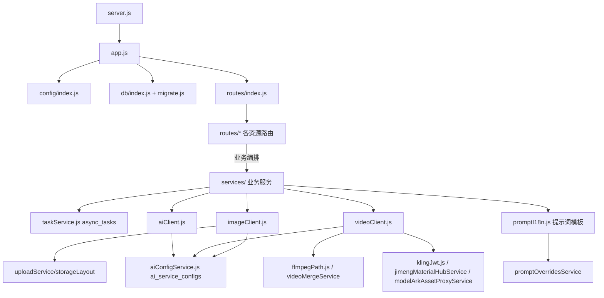
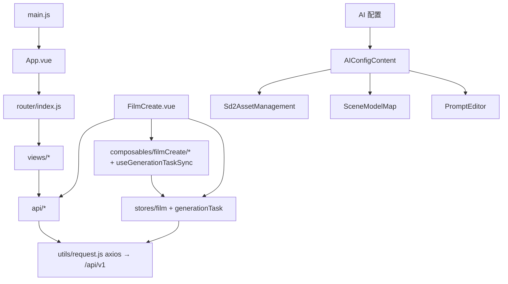

# DramaStudio（DramaStudio）Code Wiki

> 面向开发者/维护者的仓库级代码导航文档。基于 v1.2.7 源码整理，覆盖整体架构、模块职责、关键函数、数据模型、依赖关系与运行方式。
> 阅读建议：先读 [整体架构](#2-整体架构与模块划分)，再按需深入对应章节。

---

## 目录

- [1. 项目概述](#1-项目概述)
- [2. 整体架构与模块划分](#2-整体架构与模块划分)
- [3. 仓库目录结构](#3-仓库目录结构)
- [4. 后端 backend-node（Express + SQLite）](#4-后端-backend-nodeexpress--sqlite)
  - [4.1 启动链路](#41-启动链路)
  - [4.2 配置系统](#42-配置系统)
  - [4.3 数据库层与迁移机制](#43-数据库层与迁移机制)
  - [4.4 统一响应与日志](#44-统一响应与日志)
  - [4.5 REST API 路由总览](#45-rest-api-路由总览)
  - [4.6 核心业务服务（Services）](#46-核心业务服务services)
  - [4.7 AI 能力客户端（aiClient / imageClient / videoClient）](#47-ai-能力客户端)
  - [4.8 异步任务系统](#48-异步任务系统)
- [5. 前端 frontweb（Vue 3 + Vite）](#5-前端-frontwebvue-3--vite)
  - [5.1 入口与路由](#51-入口与路由)
  - [5.2 视图（views）](#52-视图views)
  - [5.3 状态管理（Pinia stores）](#53-状态管理pinia-stores)
  - [5.4 组合式函数（composables）](#54-组合式函数composables)
  - [5.5 API 封装层](#55-api-封装层)
  - [5.6 关键组件](#56-关键组件)
- [6. 数据模型（SQLite）](#6-数据模型sqlite)
- [7. 本地文件存储布局](#7-本地文件存储布局)
- [8. 依赖关系图](#8-依赖关系图)
- [9. 关键业务链路时序](#9-关键业务链路时序)
- [10. 项目运行方式](#10-项目运行方式)
- [11. 测试](#11-测试)
- [12. 桌面端打包（Electron / desktop）](#12-桌面端打包electron--desktop)
- [13. 开发约定与二次开发指南](#13-开发约定与二次开发指南)

---

## 1. 项目概述

**DramaStudio（DramaStudio）** 是一个**本地部署、数据自控、开箱即用**的 AI 短剧 & 漫剧生成工具。用户提供故事梗概与画风后，系统自动完成：**多集剧本 → 角色/场景/道具提取 → 分镜脚本 → 静帧图 → 视频片段 → 整集成片** 的全流程，并支持多家 AI 服务商（文本 / 图片 / 视频三类能力独立配置）。

> 项目工程、剧本、角色与分镜数据存储在本机；图片/视频/文本生成需调用用户自行配置的云端 AI 服务，对应素材会发送至该服务商。

| 项 | 说明 |
|---|---|
| 语言 | 纯 JavaScript（无 TypeScript） |
| 后端 | Node.js (>=18) + Express + SQLite（better-sqlite3） |
| 前端 | Vue 3 + Vite + Element Plus + Pinia + Vue Router + Axios |
| 桌面壳 | Electron 28 + electron-builder（用于打包 exe） |
| 版本 | v1.2.7 |
| 进程模型 | 后端独立进程（开发）；Electron 打包后在主进程内嵌运行后端（单进程） |

---

## 2. 整体架构与模块划分

单产品三子项目共享一个仓库（无 monorepo 工具链）：

```
┌────────────────────────────────────────────────────────────────┐
│                          前端 frontweb                         │
│  (Vue3 + Element Plus + Pinia)  http://localhost:3013 (dev)    │
│  views ── stores ── composables ── api/*(axios)                │
└───────────────┬──────────────────────────┬─────────────────────┘
                │ /api (vite proxy →5679)  │ /static (图片视频)
┌───────────────▼──────────────────────────▼─────────────────────┐
│                          后端 backend-node                     │
│  Express http://localhost:5679                                  │
│  routes(API v1) → services(业务/生成) → clients(厂商SDK调用)     │
│  db: SQLite (data/drama_generator.db)  files: data/storage/     │
└───────┬──────────────────────────────┬──────────────────────────┘
        │                              │
   ┌────▼─────┐                  ┌─────▼──────┐
   │ 多厂商 AI │  文本/图片/视频    │ ffmpeg 本地 │ 合成/归一化/尾帧提取
   │ API 服务 │ ←──────────────→ │ 工具链      │
   └──────────┘                  └────────────┘
┌────────────────────────────────────────────────────────────────┐
│                    desktop/  Electron 壳层                      │
│  打包 exe：主进程内嵌后端 + 伺服 frontweb/dist + 分发随机端口     │
└────────────────────────────────────────────────────────────────┘
```

**分层职责速览**

| 层 | 位置 | 职责 |
|---|---|---|
| 路由层 | `backend-node/src/routes/` | REST 接口定义、参数校验、调用服务、统一响应 |
| 服务层 | `backend-node/src/services/` | 全部业务逻辑：CRUD、AI 提取/生成编排、导出导入、ffmpeg 合成、任务管理 |
| 客户端层 | `aiClient.js` / `imageClient.js` / `videoClient.js` | 与具体厂商 API 通信的唯一出口（多协议分派） |
| 数据层 | `backend-node/src/db/` + `migrations/` | SQLite 连接（WAL）、启动迁移与运行时兜底补列 |
| 前端视图层 | `frontweb/src/views/` | 6 个页面（列表 / 剧集管理 / 制作 / AI配置 / 自由创作 / 素材库） |
| 前端状态层 | `frontweb/src/stores/` + `composables/` | 会话态（film）+ 任务轮询态（generationTask）+ 复用逻辑 |
| 桌面壳 | `desktop/main.js` | Electron 窗口、后端内嵌启动、ffmpeg 分发、config 同步 |

---

## 3. 仓库目录结构

```
DramaStudio/
├── backend-node/            # 后端（核心） 端口 5679
│   ├── src/
│   │   ├── server.js        # HTTP 入口（加载配置→启动监听→优雅退出）
│   │   ├── app.js           # Express 应用装配（中间件/静态/路由/错误处理）
│   │   ├── logger.js        # 简单分级日志（支持 LOG_FILE 追加）
│   │   ├── response.js      # 统一响应体构造器
│   │   ├── config/          # YAML 配置加载 + videoGeneration 超时解析
│   │   ├── constants/       # 画风预设（与前端 styleOptions 同步）
│   │   ├── db/              # SQLite 连接 & 迁移 & 兜底补列
│   │   ├── routes/          # 24 个路由模块 + 总入口 index.js
│   │   ├── services/        # 50+ 业务/AI 客户端服务
│   │   └── utils/           # ffmpeg 定位 / JSON 安全解析 / 画风合并 / 清洗等
│   ├── configs/             # config.yaml + 预设 SQL
│   ├── migrations/          # 01_init.sql ~ 22_*.sql 增量迁移
│   ├── test/                # node --test 单测（4 个文件）
│   ├── tools/ffmpeg/        # Windows ffmpeg.exe（含 README）
│   └── data/                # 运行时生成：db + storage（不入库）
├── frontweb/                # 前端（核心） 端口 3013
│   └── src/
│       ├── main.js / App.vue
│       ├── router/index.js
│       ├── views/           # 6 个页面
│       ├── stores/          # film / generationTask
│       ├── composables/     # 制作页逻辑拆分 + 主题 + 任务同步
│       ├── api/             # 16 个后端接口封装
│       ├── components/      # AI 配置、提示词编辑器、风格选择器等
│       ├── constants/       # styleOptions（画风下拉静态数据）
│       ├── styles/          # theme.css（亮/暗主题变量）
│       ├── utils/           # request.js axios 封装、分镜表导出等
│       └── test/            # modelSelection 单测
├── desktop/                 # Electron 桌面壳（打包 exe）
│   ├── main.js              # 主进程
│   ├── scripts/             # copy-backend / copy-front / dist-cn
│   ├── electron-builder*.json  # 打包配置（完整版 / Lite / Mac）
│   ├── ffmpeg-mac/          # macOS ffmpeg 资源
│   └── dist/                # 打包临时产物
├── docs/                    # 文档（本文件所在目录）

├── start.bat / run_dev.bat / run_dev.ps1   # 一键启动
└── README.md / AGENTS.md / CHANGELOG.md / docs/*.md
```

> 说明：`docs/PROJECT_STRUCTURE.md` 记录当前磁盘实际目录结构，与本文档互为补充。

---

## 4. 后端 backend-node（Express + SQLite）

### 4.1 启动链路

**入口**：[server.js](file:///d:/zmzc-code/DramaStudio/backend-node/src/server.js)

1. `loadConfig()` 读取 YAML；若 `server.insecure_tls` 开启则设 `NODE_TLS_REJECT_UNAUTHORIZED=0`（仅测试用）。
2. `createApp()`（[app.js](file:///d:/zmzc-code/DramaStudio/backend-node/src/app.js)）：
   - 打开数据库 → `runMigrationsAndEnsure(db)`（迁移 + 兜底补列）；
   - `applyVendorLock(...)`（厂商锁定：把配置文件中的 AI 配置同步进 DB）；
   - 注册中间件：`express.json({limit:'10mb'})`、CORS（白名单来自 config）、请求日志；
   - 把存储根目录（`config.storage.local_path`，默认 `data/storage`）挂到 `GET /static`；
   - `GET /health` 健康检查；挂载全部路由前缀 `/api/v1`；
   - **伺服前端产物**：若 `frontweb/dist`（或 `WEB_DIST_PATH`）存在则 express.static + SPA fallback；否则根路径返回"请先构建前端"提示页；
   - 404 兜底 + 全局错误处理（文件过大→413）。
3. `app.listen(port)`：端口 = `process.env.PORT` 或 config `server.port`（默认 5679）。
4. 注册 SIGINT/SIGTERM 优雅关闭（`server.close()` + `closeDb()`）。

**日志**：[logger.js](file:///d:/zmzc-code/DramaStudio/backend-node/src/logger.js)：`log(level, msg, ...args)`，若设置环境变量 `LOG_FILE` 则同时追加写入文件（便于打包 exe 双击查日志）。导出 `info/warn/error`（含带 `w` 后缀别名 `infow/warnw/errorw`）。

### 4.2 配置系统

- **加载**：[config/index.js](file:///d:/zmzc-code/DramaStudio/backend-node/src/config/index.js) 按三个路径探测 `configs/config.yaml` → `config.yaml` → 相对源码路径，用 js-yaml 解析；缺少 `app.name` 即报错。
- **主配置**：[config.yaml](file:///d:/zmzc-code/DramaStudio/backend-node/configs/config.yaml) 关键段：

```yaml
app:      # name / version / debug / language(zh|en 提示词语言)
server:   # port:5679 host cors_origins insecure_tls
database: # type:sqlite path:./data/drama_generator.db
storage:  # type:local local_path:./data/storage base_url
video:    # generation_timeout_minutes:30（异步视频轮询超时）
ai:       # default_*_provider / vlm_quality(视觉质检开关)
style:    # default_*_style / default_*_ratio / default_image_size
vendor_lock: # enabled / config_file（桌面打包时厂商锁定）
image_proxy: # use_for_video（是否图床上传）
```

- **视频超时**：[config/videoGeneration.js](file:///d:/zmzc-code/DramaStudio/backend-node/src/config/videoGeneration.js) 导出 `resolveVideoGenerationTimeoutMinutes(cfg)`（默认 30 分钟），供 videoService 轮询上限与前端展示使用。
- ⚠️ **API Key 不入 YAML**：AI 服务商配置（service_type/provider/base_url/api_key/model/settings）存储在数据库 `ai_service_configs` 表，由前端「AI 配置」页管理（也支持 JSON 导入导出与"一键配置通义/火山"）。

### 4.3 数据库层与迁移机制

- **连接**：[db/index.js](file:///d:/zmzc-code/DramaStudio/backend-node/src/db/index.js)：better-sqlite3 单例，`journal_mode=WAL`、`busy_timeout=5000`；目录不存在自动创建。
- **迁移**：[db/migrate.js](file:///d:/zmzc-code/DramaStudio/backend-node/src/db/migrate.js)
  - `runMigrations(db)`：按文件名排序执行 `migrations/*.sql`；对 `duplicate column / already exists` 静默跳过，`no such table` 警告跳过（交给兜底）。
  - `ensureColumns(db, table, columns)`：逐列探测 `PRAGMA table_info`，缺失则 `ALTER TABLE ADD COLUMN`。
  - `ensureAllColumns(db)`：启动时对 **所有表全量兜底补列/建表**（兼容旧库升级），覆盖 dramas / episodes / storyboards / characters / scenes / props / ai_service_configs / async_tasks / image_generations / video_generations / video_merges / assets / character_libraries / scene_libraries / prop_libraries / image_proxy_cache / ai_model_map / storyboard_characters / global_settings。
  - 启动调用：`runMigrationsAndEnsure(db)`；也可 `npm run migrate` 手动执行。

**通用字段约定**：业务表均带 `created_at/updated_at/deleted_at TEXT`（软删除）；查询一律过滤 `deleted_at IS NULL`。`metadata` 存 JSON 字符串。`local_path` 一律为相对 `data/storage/` 的相对路径。

### 4.4 统一响应与日志

[response.js](file:///d:/zmzc-code/DramaStudio/backend-node/src/response.js)：所有接口响应形如

```json
// 成功
{ "success": true, "data": {...}, "timestamp": "..." }
// 失败
{ "success": false, "error": { "code": "BAD_REQUEST|...", "message": "..." }, "timestamp": "..." }
```

辅助函数：`success / created / successWithPagination / error / badRequest / notFound / forbidden / internalError`。

### 4.5 REST API 路由总览

所有接口前缀 `/api/v1`。路由由 [routes/index.js](file:///d:/zmzc-code/DramaStudio/backend-node/src/routes/index.js) 统一装配（`setupRouter(cfg, db, log)`），模块划分如下：

| 路由模块 | 前缀/资源 | 主要职责 |
|---|---|---|
| [drama.js](file:///d:/zmzc-code/DramaStudio/backend-node/src/routes/drama.js) | `/dramas`、`/episodes/:id/...` | 项目 CRUD、outline/episodes/characters/progress 保存、示例项目、导出/导入、finalizeEpisode 合成入口 |
| [task.js](file:///d:/zmzc-code/DramaStudio/backend-node/src/routes/task.js) | `/tasks` | 异步任务查询（轮询入口） |
| [aiConfig.js](file:///d:/zmzc-code/DramaStudio/backend-node/src/routes/aiConfig.js) | `/ai-configs` | AI 配置 CRUD / test / vendor-lock / bulk-update-key / 即梦2素材 / ModelArk 资产 |
| [settings.js](file:///d:/zmzc-code/DramaStudio/backend-node/src/routes/settings.js) | `/settings` | 语言、生成设置（并发数） |
| [promptOverrides.js](file:///d:/zmzc-code/DramaStudio/backend-node/src/routes/promptOverrides.js) | `/settings/prompts` | 高级提示词覆盖（list/update/reset） |
| [sceneModelMap.js](file:///d:/zmzc-code/DramaStudio/backend-node/src/routes/sceneModelMap.js) | `/scene-model-map` | 业务场景→模型映射 |
| [characterLibrary.js / sceneLibrary.js / propLibrary.js](file:///d:/zmzc-code/DramaStudio/backend-node/src/routes/characterLibrary.js) | `/character-library` 等 | 三类素材库 CRUD（drama_id 区分全局/本剧） |
| [characters.js](file:///d:/zmzc-code/DramaStudio/backend-node/src/routes/characters.js) | `/characters` | 角色 CRUD + 生图/四视图/提示词/SD2 认证/上传等 |
| [scenes.js](file:///d:/zmzc-code/DramaStudio/backend-node/src/routes/scenes.js) | `/scenes` | 场景 CRUD + 生图/四视图/提取 |
| [prop.js](file:///d:/zmzc-code/DramaStudio/backend-node/src/routes/prop.js) | `/props`、`/episodes/:id/props/extract` | 道具 CRUD/生图/提取/关联分镜 |
| [storyboards.js](file:///d:/zmzc-code/DramaStudio/backend-node/src/routes/storyboards.js) | `/storyboards` | 分镜 CRUD/帧提示词/润色/全能片段(NDJSON流)/批量推断/upscale 等 |
| [storyboards_tail_link.js](file:///d:/zmzc-code/DramaStudio/backend-node/src/routes/storyboards_tail_link.js) | `/storyboards/:id/link-tail-frame` | 尾帧衔接 |
| [images.js](file:///d:/zmzc-code/DramaStudio/backend-node/src/routes/images.js) | `/images` | 图片生成记录管理、episode 背景批量等 |
| [videos.js](file:///d:/zmzc-code/DramaStudio/backend-node/src/routes/videos.js) | `/videos` | 视频生成记录管理（create 即 setImmediate 异步执行） |
| [videoMerges.js](file:///d:/zmzc-code/DramaStudio/backend-node/src/routes/videoMerges.js) | `/video-merges` | 整集合成任务记录 |
| [assets.js](file:///d:/zmzc-code/DramaStudio/backend-node/src/routes/assets.js) | `/assets` | 通用素材库 CRUD / 从生成记录导入 |
| [audio.js](file:///d:/zmzc-code/DramaStudio/backend-node/src/routes/audio.js) | `/audio/extract[/batch]` | 对白/旁白 TTS |
| [upload.js](file:///d:/zmzc-code/DramaStudio/backend-node/src/routes/upload.js) | `/upload/image`、`/extract-description-from-image` | 图片上传 / 通用图提取描述 |
| [subtitles.js](file:///d:/zmzc-code/DramaStudio/backend-node/src/routes/subtitles.js) | `/subtitles/*` | SRT 解析/渲染/导出（移植自 autoclip） |
| [stub.js](file:///d:/zmzc-code/DramaStudio/backend-node/src/routes/stub.js) | 少量兼容接口 | 剧集角色提取等转发 |

> ⚠️ 路由注册顺序敏感点已处理：`GET /dramas/:id/export`、`POST /dramas/import`、`/ai-configs/vendor-lock`、`/ai-configs/bulk-update-key` 等必须放在带 `:id` 的通用路由**之前**。

**生成类非资源路由**（在 index.js 内联）：`POST /generation/characters`（角色提取任务）、`POST /generation/story`（故事扩写，纯返回不落库）、`POST /episodes/:episode_id/storyboards`（分镜生成，经 dramaService 转发）。

### 4.6 核心业务服务（Services）

> 表格中带 ★ 的服务是业务主链路的关键节点。所有长耗时服务遵循统一模式：**`taskService.createTask` → `setImmediate` 异步执行 → `updateTaskStatus/Result/Error`**。

#### 聚合与入口层

| 文件 | 职责与关键函数 |
|---|---|
| [dramaService.js](file:///d:/zmzc-code/DramaStudio/backend-node/src/services/dramaService.js) ★ | 项目聚合根。`createDrama`（写 storage_folder_label）、`getDrama`（深度聚合：分镜按镜号去重、按需回写 episode.duration 分钟数）、`saveEpisodes` / `saveCharacters`（**按 key upsert**，不覆盖已有图片字段；主图漂移时经 `seedance2AssetGuards` 让 SD2 素材失活）、`saveOutline`（style key → metadata.style_prompt_zh/en 展开）、`generateStoryboard`（薄转发）、`finalizeEpisode`（成片合成入口，见 §9）、`getVideoUrlForStoryboard`（优先用户选定 → 最新 completed 视频记录） |
| [dramaExportService.js](file:///d:/zmzc-code/DramaStudio/backend-node/src/services/dramaExportService.js) | 整剧打包 ZIP：`exportDrama() -> {buffer,title}`。project.json(v1.4) 中角色/场景/道具按下标引用；媒体按 `media/{category}` 落包；首尾帧通过 `original_id` 还原 |
| [dramaImportService.js](file:///d:/zmzc-code/DramaStudio/backend-node/src/services/dramaImportService.js) | ZIP 逆向还原（含老版本兼容）。全程 `db.transaction`，失败整体回滚 |
| [novelImportService.js](file:///d:/zmzc-code/DramaStudio/backend-node/src/services/novelImportService.js) | TXT/小说导入：章节正则识别 → 每章 AI 转写为短剧剧本（200-500 字） |

#### 生成编排服务

| 文件 | 职责与关键函数 |
|---|---|
| [storyGenerationService.js](file:///d:/zmzc-code/DramaStudio/backend-node/src/services/storyGenerationService.js) | 梗概→多集剧本。`generateStory()` 不落库纯返回；集数钳制 1~20；兼容三种 AI 返回形态；解析失败整段兜底为第 1 集 |
| [characterGenerationService.js](file:///d:/zmzc-code/DramaStudio/backend-node/src/services/characterGenerationService.js) | 角色提取任务：`generateCharacters`（建 character_generation task）→ `processCharacterGeneration`（AI 提取 JSON 数组、按 `drama_id+name` 去重入库、后台 enrichIdentityAnchors 六层视觉锚点 + 预生成 polished_prompt） |
| [episodeStoryboardService.js](file:///d:/zmzc-code/DramaStudio/backend-node/src/services/episodeStoryboardService.js) ★ | 分镜生成全流程（见 §9 第 5 步）：`generateStoryboard`/`processStoryboardGeneration`；流式回调边出边入库（`tryIncrementalSave`）；截断最多 3 次续写按镜号去重合并；终版 `saveStoryboards` 用最终 JSON UPDATE 覆盖已入库行（修复首镜解说缺失）；`deriveStoryboardFieldsFromAi`（时长/结构化视角三元组 angle_h/v/s/提示词拼装）；`splitStoryboardByAudio`（按对白/旁白拆镜） |
| [backgroundExtractionService.js](file:///d:/zmzc-code/DramaStudio/backend-node/src/services/backgroundExtractionService.js) | 场景背景提取：软删本集场景→重建→setImmediate 预生成 polished_prompt（中文需求回译） |
| [propExtractionService.js](file:///d:/zmzc-code/DramaStudio/backend-node/src/services/propExtractionService.js) | 道具提取：软删→upsert→缺 prompt 补生成 |
| [framePromptService.js](file:///d:/zmzc-code/DramaStudio/backend-node/src/services/framePromptService.js) | 单镜首/关键/尾帧提示词生成并落 `frame_prompts`；`generateSingleFrame` 被宫格图生成复用；`sanitizeFramePrompt` 剔除未出场角色 |
| [tailFrameLinkService.js](file:///d:/zmzc-code/DramaStudio/backend-node/src/services/tailFrameLinkService.js) | 尾帧衔接：用 ffmpeg 提取上一镜已生成视频末帧，作为 image_generations(provider=tail-frame) 插入并绑定为下一镜首帧 |

#### 实体资源服务（角色/场景/道具 + 素材库）

| 文件 | 职责与关键函数 |
|---|---|
| [characterLibraryService.js](file:///d:/zmzc-code/DramaStudio/backend-node/src/services/characterLibraryService.js) | 角色库（全局/本剧）与角色图生成：`generateCharacterImage`、`generateCharacterFourViewImage`、`generateCharacterPromptOnly`、`addToLibrary/AddToMaterialLibrary`、SD2 certify（jimeng hub 注册）/refresh、`sd2VoiceUpload` 音色 |
| [sceneService.js](file:///d:/zmzc-code/DramaStudio/backend-node/src/services/sceneService.js) | 场景 CRUD + `generateScenePromptOnly`（四视图）/`generateSceneSinglePromptOnly`、`generateSceneFourViewImage`、`extractSceneFromImage`（VLM 反演） |
| [propService.js](file:///d:/zmzc-code/DramaStudio/backend-node/src/services/propService.js) | 道具 CRUD、`generatePropPromptOnly`、`associateWithStoryboard`（全量重写 storyboard_props）、`extractPropFromImage` |
| [propImageGenerationService.js](file:///d:/zmzc-code/DramaStudio/backend-node/src/services/propImageGenerationService.js) | 道具生图任务：`generatePropImage`/`processPropImageGeneration`（出图→落盘→旧图进 extra_images） |
| [sceneLibraryService.js](file:///d:/zmzc-code/DramaStudio/backend-node/src/services/sceneLibraryService.js) / [propLibraryService.js](file:///d:/zmzc-code/DramaStudio/backend-node/src/services/propLibraryService.js) | 场景库/道具库 CRUD |
| [libraryDedup.js](file:///d:/zmzc-code/DramaStudio/backend-node/src/services/libraryDedup.js) | 三类库**身份键去重**：按 `source_type+source_id / image_url(sha256) / local_path` 判定已存在（防重复加库） |

#### 图片 / 视频 / 合成执行服务

| 文件 | 职责与关键函数 |
|---|---|
| [imageService.js](file:///d:/zmzc-code/DramaStudio/backend-node/src/services/imageService.js) ★ | 分镜图生成总装线。`create`（插 pending 记录+任务）→ `processImageGeneration`：宫格提示词（`buildQuadGridPrompt`/`buildNineGridPrompt`）→ 参考图解析与合并（尾帧自动注入"站位锁"）→ 尺寸换算（`aspectRatioToSize`）→ prompt 二次优化（存在 polished_prompt 则直接采用）→ `imageClient.callImageApi` 出图 → 下载归一化 → 绑定首尾帧（`bindStoryboardFrameImage`）→ 宫格 sharp 拆分（`splitQuadGridToImages`/`splitNineGridToImages`）。`syncStoryboardCharacters` 文本匹配补全角色 |
| [storyboardFrameBinding.js](file:///d:/zmzc-code/DramaStudio/backend-node/src/services/storyboardFrameBinding.js) | `bindStoryboardFrameImage`：把 image_generations 绑定为 storyboard 首帧/尾帧（frame_type 别名归一化 first/last） |
| [storyboardService.js](file:///d:/zmzc-code/DramaStudio/backend-node/src/services/storyboardService.js) | 分镜/帧提示词 CRUD：`updateStoryboard`（白名单字段、角色同步 storyboard_characters、道具全量重写）、`insertBeforeStoryboard`（同集后续镜号 +1 后插空镜）、`saveFramePrompt`（(storyboard_id, frame_type) upsert） |
| [videoService.js](file:///d:/zmzc-code/DramaStudio/backend-node/src/services/videoService.js) ★ | 视频生成执行体。`processVideoGeneration`：读配置→时长画幅推算→`videoClient.callVideoApi`（同步 URL 直取 / 异步 task_id 每 10s 轮询，上限=超时配置）→ 下载本地 → ffmpeg 归一化（`normalizeVideoFileToTargetPixels`，scale+pad 黑边）→ 回写 storyboards.video_url |
| [videoMergeService.js](file:///d:/zmzc-code/DramaStudio/backend-node/src/services/videoMergeService.js) ★ | 分镜视频 ffmpeg concat 合成整集。`processVideoMerge`：片段 URL→本地（baseUrl 映射/下载到 tmp）→ `runFfmpegConcat`（concat demuxer + `-c copy`）→ 按 merge_options 走 [mergedEpisodePostProcess.js](file:///d:/zmzc-code/DramaStudio/backend-node/src/services/mergedEpisodePostProcess.js)（烧旁白字幕 / 混对白 TTS / drawtext 水印）→ 回写 episodes.video_url |
| [narrationVideoPostProcess.js](file:///d:/zmzc-code/DramaStudio/backend-node/src/services/narrationVideoPostProcess.js) | 解说旁白音轨后处理辅助 |
| [assetService.js](file:///d:/zmzc-code/DramaStudio/backend-node/src/services/assetService.js) | 通用素材库 CRUD + `importFromImage/importFromVideo`（从生成记录一键入库） |

#### 支撑 / 工具型服务

| 文件 | 职责与关键函数 |
|---|---|
| [uploadService.js](file:///d:/zmzc-code/DramaStudio/backend-node/src/services/uploadService.js) | 落盘与图床：`uploadFile`（返回 {url, local_path}）、`downloadImageToLocal`（http/data:base64，Electron 下用原生 http 模块、支持重定向与重试）、`uploadToImageProxy`（中转图床，失败重试 3 次） |
| [storageLayout.js](file:///d:/zmzc-code/DramaStudio/backend-node/src/services/storageLayout.js) | 目录布局约定：`getProjectStorageSubdir`（projects/{4位id}_{date}_{固化剧名} 或 library）、`ensureDramaStorageFolderLabel`、`sanitizeFolderLabel` |
| [ttsService.js](file:///d:/zmzc-code/DramaStudio/backend-node/src/services/ttsService.js) | 对白/旁白 TTS：`synthesize`（provider=minimax→t2a_v2；openai 兼容→`/audio/speech`）写 `audio/tts_sb{id}_{uuid}.mp3`，回写 storyboard 音频字段 |
| [subtitleEditorService.js](file:///d:/zmzc-code/DramaStudio/backend-node/src/services/subtitleEditorService.js) | SRT 解析/按字幕裁剪视频（`parseSrtToWordLevel`/`editVideoBySubtitle`），纯文件 + ffmpeg |
| [storyboardFrameBinding.js 等 utils](file:///d:/zmzc-code/DramaStudio/backend-node/src/utils/safeJson.js) | `safeJson.js`（`safeParseAIJSON` 含 jsonrepair 修复）、[ffmpegPath.js](file:///d:/zmzc-code/DramaStudio/backend-node/src/utils/ffmpegPath.js)（ffmpeg/ffprobe 定位，见 §12）、[dramaStyleMerge.js](file:///d:/zmzc-code/DramaStudio/backend-node/src/utils/dramaStyleMerge.js)（`mergeCfgStyleWithDrama`：项目画风 + 全局配置合并）、[framePromptSanitize.js](file:///d:/zmzc-code/DramaStudio/backend-node/src/utils/framePromptSanitize.js)、[seedance2AssetGuards.js](file:///d:/zmzc-code/DramaStudio/backend-node/src/utils/seedance2AssetGuards.js) |
| [vlmQualityService.js](file:///d:/zmzc-code/DramaStudio/backend-node/src/services/vlmQualityService.js) | 视觉质检：`regenerateUntilAcceptable`（图生后自动 VLM 评分，低于阈值重试）、`checkEpisodeContinuity`（成片后站位/朝向连续性检查） |
| [promptI18n.js](file:///d:/zmzc-code/DramaStudio/backend-node/src/services/promptI18n.js) | **全应用 AI 提示词中枢**（约 141KB）：中英双语模板 + `prompt_overrides` 覆盖缓存。导出 `getCharacterExtractionPrompt/getPropExtractionPrompt/getSceneExtractionPrompt/getStoryboardSystemPrompt/getFirstFramePrompt/.../getImagePolishPrompt/getUniversalOmniSegmentPrompt/getStoryExpansionSystemPrompt/...` 等全套模板族 |
| [promptOverridesService.js](file:///d:/zmzc-code/DramaStudio/backend-node/src/services/promptOverridesService.js) | prompt_overrides 表 CRUD（启动时装载到 promptI18n 缓存） |
| [aiConfigService.js](file:///d:/zmzc-code/DramaStudio/backend-node/src/services/aiConfigService.js) | `ai_service_configs` CRUD/测试连接/vendor_lock 同步/批量换 key |
| [mediaAspectRatioSpec.js](file:///d:/zmzc-code/DramaStudio/backend-node/src/services/mediaAspectRatioSpec.js) | 画幅→尺寸规格换算 |
| [universalSegment*.js](file:///d:/zmzc-code/DramaStudio/backend-node/src/services/universalSegmentPromptBundle.js) | 全能模式片段提示词组装与子镜时长/`@图片N` 归一化 |

### 4.7 AI 能力客户端

> 与厂商通信的唯一出口，所有生成最终汇聚到这三个客户端。配置从 `ai_service_configs` 表读取（而非 YAML）。

#### [aiClient.js](file:///d:/zmzc-code/DramaStudio/backend-node/src/services/aiClient.js) —— 文本/视觉

| 函数 | 用途 |
|---|---|
| `generateText(db, log, serviceType, userPrompt, systemPrompt, options)` | 通用文本生成；options 支持 `model/temperature/json_mode/max_tokens/scene_key/streamCallback`；流式优先、失败降级非流式 |
| `streamGenerateText(..., onDelta)` | SSE 增量回调（分镜生成用） |
| `generateTextWithVision(..., imageSource, options)` | OpenAI vision 格式，兼容 o1/Gemini/Qwen-VL |
| `extractDescriptionFromImage(db, log, entityType, imageUrl, entityName)` | 图→结构化描述（含"真人拒绝"安全策略） |
| `getDefaultConfig/getConfigForModel/getConfigFromModelMap` | 配置解析与 `ai_model_map` 业务场景路由 |

#### [imageClient.js](file:///d:/zmzc-code/DramaStudio/backend-node/src/services/imageClient.js) —— 图片

| 函数 | 用途 |
|---|---|
| `callImageApi(db, log, opts)` | 统一入口，按协议路由到 openai / volcengine(Seedream) / dashscope(通义万象) / nano_banana / kling / gemini / comfyui / sdwebui；自动 size 修正、多参考图注入防分栏负面词 |
| `createAndGenerateImage(db, log, opts)` | 资产生图一站式：建 async_tasks + 插 image_generations + setImmediate 异步执行并回写 |
| `getDefaultImageConfig(db, preferredModel?, preferredProvider?, imageServiceType?)` | 图配置选择 |
| `getProxyCache/setProxyCache` | 中转图床 URL 缓存（image_proxy_cache 表） |

#### [videoClient.js](file:///d:/zmzc-code/DramaStudio/backend-node/src/services/videoClient.js)（约 4290 行）—— 视频

| 函数 | 用途 |
|---|---|
| `callVideoApi(db, log, opts)` | 统一提交；返回 `{task_id?}` / `{video_url?}` / `{error?}`；自动做 SD2 `asset://` 素材替换与音色注入 |
| `pollVideoTask(db, log, videoGenId, taskId, config, maxAttempts=300, intervalMs=10000)` | 跨厂商统一轮询（识别 Kling / KlingOmni(`omni:`) / Volc / DashScope / Gemini / Vidu / xAI / Veo3 / Sora / ComfyUI 各类状态） |
| `getDefaultVideoConfig(db, preferredModel)` | 默认视频配置 |
| `normalizeAspectRatioForApi` | 画幅归一化 |
| 各 `callXxxVideoApi` | `callVolcengineOmniVideoApi`(Seedance2 全能+音频参考)、`callKlingOmniVideoApi`、`callKlingVideoApi`、`callDashScopeVideoApi`、`callGeminiVideoApi`(Veo)、`callViduVideoApi`、`callVeo3VideoApi`、`callSoraVideoApi`、`callComfyUiVideoApi`、`callXaiVideoApi`、`callJimengAiApiVideo` |

**协议判定优先级**：显式 `api_protocol`（openai/volcengine/dashscope/gemini/nano_banana/agnes/minimax/volcengine_omni/kling_omni/veo3/sora）> 由 provider 推断。

> **视频模型收敛**：AI 配置页仅暴露 WAN 3.0 / MiniMax Hailuo-03 / Agnes Video 2.5 三家
> （见 `frontweb/src/components/AIConfigContent.vue` 的 `providerConfigs.video`）。
> 上表其余适配器代码仍保留，恢复只需在前端列表加回条目。

#### 辅助认证/网关客户端

| 文件 | 职责 |
|---|---|
| [deepseekConfig.js](file:///d:/zmzc-code/DramaStudio/backend-node/src/services/deepseekConfig.js) | DeepSeek 官方 thinking/reasoning_effort 注入（`applyDeepSeekChatOptions`），模型别名映射 v4-flash |
| [klingJwt.js](file:///d:/zmzc-code/DramaStudio/backend-node/src/services/klingJwt.js) | 可灵官方 AccessKey/SecretKey → HS256 JWT（`signKlingOfficialJwt`），供 Kling Omni 官方鉴权 |
| [jimengMaterialHubService.js](file:///d:/zmzc-code/DramaStudio/backend-node/src/services/jimengMaterialHubService.js) | 即梦2角色认证素材 Hub：`createImageAsset/listAssets/pollAssetUntilSettled/hubToken`，把角色图注册为 `asset://` |
| [modelArkAssetProxyService.js](file:///d:/zmzc-code/DramaStudio/backend-node/src/services/modelArkAssetProxyService.js) | 火山方舟私有资产库 OpenAPI 代理（volc_sign AK/SK 签名或 Bearer；`callModelArkAsset` + 10 个 Action 白名单） |
| [agnesClient.js](file:///d:/zmzc-code/DramaStudio/backend-node/src/services/agnesClient.js) | Agnes AI 适配器。⚠️ **当前无任何代码引用**（孤立文件，仅读 `AGNES_API_KEY` 环境变量），未接入主流程 |

### 4.8 异步任务系统

**数据表 `async_tasks`**（id 为 UUID 字符串）：

| 列 | 含义 |
|---|---|
| type | `character_generation / storyboard_generation / image_generation / video_generation / video_merge / background_extraction / prop_extraction / frame_prompt_generation / tts / ...` |
| status | `pending → processing → completed \| failed` |
| progress | 0~100（业务代码按阶段显式写入） |
| resource_id | 指向业务对象 id（drama_id/episode_id/字符资源 id） |
| result / error | 成功结果 JSON / 失败原因 |

**核心封装**：[taskService.js](file:///d:/zmzc-code/DramaStudio/backend-node/src/services/taskService.js) —— `createTask` / `getTask` / `getTasksByResource` / `updateTaskStatus` / `updateTaskResult`（completed, progress=100）/ `updateTaskError`（failed, progress=0）。

**轮询入口**：`GET /tasks/:task_id`（单任务）、`GET /tasks?resource_id=`（资源下任务列表）。

**机制要点**：
1. 所有生成类接口先同步返回 `{task_id, status:'pending'}`；前端持有 task_id 轮询。
2. 典型进度节奏（分镜生成）：10 开始生成 → 30 流式入库中 → 50 解析 → 70 保存 → 75 校验 → 90 更新时长 → 100 完成 / 失败归 0。
3. **后端没有进程内并发队列/信号量**。并发数（图片 `pipeline_concurrency` 默认 3、视频 `pipeline_video_concurrency` 默认 3）存 `global_settings`，由前端读取后自行限制同时发出的请求数；后端请求即 `setImmediate` 异步执行。
4. 视频异步任务受 `video.generation_timeout_minutes`（默认 30 分钟）轮询上限约束。

---

## 5. 前端 frontweb（Vue 3 + Vite）

技术栈：Vue 3（Composition API）+ Vite 5 + Element Plus + Pinia + Vue Router 4 + Axios。dev 端口 **3013**，`/api` 与 `/static` 代理到 `127.0.0.1:5679`（见 [vite.config.js](file:///d:/zmzc-code/DramaStudio/frontweb/vite.config.js)）。

### 5.1 入口与路由

- [main.js](file:///d:/zmzc-code/DramaStudio/frontweb/src/main.js)：先副作用 import 主题 composable（挂载前应用亮/暗主题）→ Pinia → Element Plus(zh-cn locale) → 全局注册全部图标 → ElConfigProvider（message 5s、可关闭）。
- [router/index.js](file:///d:/zmzc-code/DramaStudio/frontweb/src/router/index.js)（history 模式）：

| 路径 | name | 视图 | 用途 |
|---|---|---|---|
| `/` | list | FilmList.vue | 首页项目卡片墙 + 新建/导入 + 全局素材库入口 |
| `/drama/:id` | drama-detail | DramaDetail.vue | 剧集管理：剧信息 / 分集 / 资源库（支持 `?importBatch=1` 打开批量导入） |
| `/film/:id` | film | FilmCreate.vue | **核心制作页**。`id` 可为 `'new'`（新建故事）；`?episode=<epId>` 定位到指定集并双向同步 |
| `/ai-config` | ai-config | AiConfig.vue | AI 配置整页 |
| `/free-create` | free-create | FreeCreate.vue | 不绑定剧集的单发图/视频生成 |
| `/media-library` | media-library | MediaLibrary.vue | 全局媒体素材库 |

- 全局 `beforeEach` 按 `meta.title` 设置 `document.title`。

### 5.2 视图（views）

| 视图 | 结构与职责要点 |
|---|---|
| [FilmList.vue](file:///d:/zmzc-code/DramaStudio/frontweb/src/views/FilmList.vue) | 项目卡片墙；快速开始卡片（新建/导入/示例）；三类全局素材库弹窗（分页+关键词+编辑+上传/AI 生图，生图后 1.5s 轮询任务最长约 7.5min）；新建项目选画幅（16:9/9:16/3:4/1:1/4:3/21:9）；厂商锁定（vendorLock）时隐藏微信入口 |
| [DramaDetail.vue](file:///d:/zmzc-code/DramaStudio/frontweb/src/views/DramaDetail.vue) | 剧信息（风格/画幅 blur+600ms 防抖保存）、分集卡片（整体重写式增删集）、本剧资源库 6 Tab（本剧角色/场景/道具库 + 全剧制作资源）、批量导入剧集弹窗 |
| [FilmCreate.vue](file:///d:/zmzc-code/DramaStudio/frontweb/src/views/FilmCreate.vue) | **约 8000 行，全项目最大文件**。左导航 7 步状态机（剧本→角色→道具→场景→分镜脚本→分镜图→分镜视频）+ 任务面板。区块：剧本工作台（创作/选择/导入小说）→ 一键流水线（含暂停/补全/并发）→ 角色/道具/场景资源面板（含 SD2 认证）→ 分镜生成配置与逐镜三栏编辑器（左脚本/中图片+全能片段/右视频历史）→ 视频配置 → 合成整集。恢复机制：`applyRouteToStore` / `recoverAndSyncEpisodeTasks`（刷新后恢复轮询） |
| [AiConfig.vue](file:///d:/zmzc-code/DramaStudio/frontweb/src/views/AiConfig.vue) | 壳页，内嵌 AIConfigContent |
| [FreeCreate.vue](file:///d:/zmzc-code/DramaStudio/frontweb/src/views/FreeCreate.vue) | 单发图片/视频（参考图上传），独立轮询（图片上限 3min，视频读 generation 设置默认 30min），不接 genStore |
| [MediaLibrary.vue](file:///d:/zmzc-code/DramaStudio/frontweb/src/views/MediaLibrary.vue) | 全局 assets 素材管理（直接 request.get('/assets')，类型/关键词筛选、多选上传、批量操作） |

### 5.3 状态管理（Pinia stores）

| Store | 状态 / 要点 |
|---|---|
| [film.js](file:///d:/zmzc-code/DramaStudio/frontweb/src/stores/film.js) | 会话态：`drama`、`currentEpisode`、`storyInput/scriptContent`、`videoResolution`(默认480p)、`videoStateByKey`（key=`dramaId:episodeId` 的合成进度表）。派生 `characters/scenes/props/storyboards` 均取当前集。`reset()` 保留合成进度表（跨剧切换不丢） |
| [generationTaskStore.js](file:///d:/zmzc-code/DramaStudio/frontweb/src/stores/generationTaskStore.js) | **任务轮询中枢**：`GEN_RESOURCE` 常量（char/prop/scene_image/sb_image/sb_first_image/sb_last_image/sb_video/episode_merge/extract_*/generate_storyboard）；`taskKey` = `dramaId:episodeId:type:resourceId`。核心 actions：`markRunning/markDone/markFailed`（成功后 3s、失败 8s 自动移除 loading）、`pollTask`（默认 2s 间隔、最长 15min、同 taskId 共享 Promise）、`attachPollIfNeeded`（刷新恢复：先查后端终态再挂轮询）、`reconcileRunningTasks`（>30min 视为僵尸清除）、`recoverPendingForEpisode`（**按集恢复**：并行拉取后端 pending/processing 图/视频/任务并重新挂轮询，见 §5.4 恢复链路） |

### 5.4 组合式函数（composables）

| 文件 | 封装内容 |
|---|---|
| [useCharacters.js](file:///d:/zmzc-code/DramaStudio/frontweb/src/composables/filmCreate/useCharacters.js) | 角色面板全套：添加/编辑（自动轮询 polished_prompt 3s×20 次）、剧本提取、生图、SD2 认证/refresh/音色上传、视觉锚点、加本剧库/加全局库/加入当前集（同名合并保留图） |
| [useScenes.js](file:///d:/zmzc-code/DramaStudio/frontweb/src/composables/filmCreate/useScenes.js) | 场景面板镜像：提取（dramaAPI.extractBackgrounds）、生图（支持四宫格 use_quad_grid）、提示词、参考图、库成员、加入当前集（按 location 匹配） |
| [useProps.js](file:///d:/zmzc-code/DramaStudio/frontweb/src/composables/filmCreate/useProps.js) | 道具面板镜像：提取、生图、base64 参考图直接提特征 |
| [libraryMembership.js](file:///d:/zmzc-code/DramaStudio/frontweb/src/composables/filmCreate/libraryMembership.js) | 素材"已在库"批量查询/记忆（按 source_type+source_ids 分 80/chunk 批量查，维护两个 Set） |
| [useNavigation.js](file:///d:/zmzc-code/DramaStudio/frontweb/src/composables/filmCreate/useNavigation.js) | 左导航折叠（<960px 自动折叠）、锚点滚动 |
| [useGenerationTaskSync.js](file:///d:/zmzc-code/DramaStudio/frontweb/src/composables/useGenerationTaskSync.js) | `buildExtractTaskMeta` / `syncGeneratingSetsFromStore`（把 genStore running 同步回页面 loading Set 并清理僵尸）/ `buildEpisodeContext` |
| [useStoryGeneration.js](file:///d:/zmzc-code/DramaStudio/frontweb/src/composables/useStoryGeneration.js) | 故事梗概→多集剧本→建剧→写集的可复用编排（`runGenerateStoryFromPremise`） |
| [useTheme.js](file:///d:/zmzc-code/DramaStudio/frontweb/src/composables/useTheme.js) | 亮/暗主题单例（localStorage `lmd-theme`，html.light/.dark） |

**恢复链路（重要机制）**：切集/刷新 → `onEpisodeSelect/loadDrama` → `recoverAndSyncEpisodeTasks` → `genStore.recoverPendingForEpisode(ctx)`：① `reconcileRunningTasks` 清僵尸 → ② 拉取后端 pending/processing 的 images/videos/tasks → ③ 按归属构造 meta → ④ `attachPollIfNeeded` 重新挂轮询 → ⑤ `syncGeneratingSetsFromStore` 同步回页面 loading；存在 EPISODE_MERGE 任务则把 film.videoStatus 置回 generating。

### 5.5 API 封装层

全部基于 [utils/request.js](file:///d:/zmzc-code/DramaStudio/frontweb/src/utils/request.js)（axios 实例）：`baseURL:'/api/v1'`，`timeout:600000`（10 分钟）；响应拦截统一**解包一层 `data`**（`res.success !== false` 即返回 `res.data`），blob 原样返回；错误拦截取后端 `error.message` 弹 ElMessage 并回写 `error.message`。各模块见下表（函数 → 后端接口）：

| 文件 | 关键函数 |
|---|---|
| [api/drama.js](file:///d:/zmzc-code/DramaStudio/frontweb/src/api/drama.js) | CRUD、saveEpisodes/saveCharacters/saveOutline/saveProgress、getStoryboards、generateStoryboard、finalizeEpisode、extractBackgrounds、exportDrama(blob)/importDrama/importNovel、listExamples/importExample |
| [api/generation.js](file:///d:/zmzc-code/DramaStudio/frontweb/src/api/generation.js) | generateCharacters、generateStory |
| [api/characters.js](file:///d:/zmzc-code/DramaStudio/frontweb/src/api/characters.js) | CRUD、generateImage/batchGenerateImages、generatePrompt、addToLibrary/addToMaterialLibrary、extractFromImage/extractAnchors、sd2Certify/CertifyRefresh/sd2VoiceUpload/VoiceRefresh |
| [api/scenes.js](file:///d:/zmzc-code/DramaStudio/frontweb/src/api/scenes.js) | CRUD、generatePrompt/generateImage/generateFourViewImage、extractFromImage、addToLibrary 等 |
| [api/props.js](file:///d:/zmzc-code/DramaStudio/frontweb/src/api/props.js) | CRUD、generatePrompt、generateImage、extractFromScript、extractFromImage、addToLibrary |
| [api/storyboards.js](file:///d:/zmzc-code/DramaStudio/frontweb/src/api/storyboards.js) | CRUD、frame-prompt/frame-prompts、polishPrompt、generateUniversalSegmentPrompt(Stream/NDJSON)、insertBefore、batchInferParams、upscale、linkTailFrame、splitByAudio |
| [api/images.js](file:///d:/zmzc-code/DramaStudio/frontweb/src/api/images.js) | list/create/upload/delete |
| [api/videos.js](file:///d:/zmzc-code/DramaStudio/frontweb/src/api/videos.js) | list/create |
| [api/task.js](file:///d:/zmzc-code/DramaStudio/frontweb/src/api/task.js) | get(taskId)、listByResource |
| [api/upload.js](file:///d:/zmzc-code/DramaStudio/frontweb/src/api/upload.js) | uploadImage、extractDescriptionFromImage |
| [api/characterLibrary.js / sceneLibrary.js / propLibrary.js](file:///d:/zmzc-code/DramaStudio/frontweb/src/api/characterLibrary.js) | 三类库 CRUD（支持 drama_id/global/source_type/source_ids/page/keyword） |
| [api/sceneModelMap.js](file:///d:/zmzc-code/DramaStudio/frontweb/src/api/sceneModelMap.js) | 业务场景映射 CRUD |
| [api/ai.js](file:///d:/zmzc-code/DramaStudio/frontweb/src/api/ai.js) | ai-configs CRUD、testConnection、listJimeng2MaterialAssets、modelArkAsset、getVendorLock、bulkUpdateKey |
| [api/prompts.js](file:///d:/zmzc-code/DramaStudio/frontweb/src/api/prompts.js) | prompts list/update/reset、generationSettings get/update |

### 5.6 关键组件

| 组件 | 职责 |
|---|---|
| [AIConfigContent.vue](file:///d:/zmzc-code/DramaStudio/frontweb/src/components/AIConfigContent.vue)（约 2100 行） | AI 配置主体（被 AiConfig 页与 FilmList/FilmCreate 弹窗复用）。5 个 tab：AI 配置（六类 service_type 徽章、JSON 导入导出、一键通义/火山、厂商锁定、批量换 Key）/ 高级提示词（PromptEditor）/ 业务场景映射（SceneModelMap）/ 生成设置 / SD2 资产 |
| [PromptEditor.vue](file:///d:/zmzc-code/DramaStudio/frontweb/src/components/PromptEditor.vue) | 各阶段 System Prompt 编辑器（locked_suffix 只读区） |
| [SceneModelMap.vue](file:///d:/zmzc-code/DramaStudio/frontweb/src/components/SceneModelMap.vue) | 业务场景→模型路由表管理 |
| [StylePickerButton.vue](file:///d:/zmzc-code/DramaStudio/frontweb/src/components/StylePickerButton.vue) | 画风图文选择器（options 来自 [constants/styleOptions.js](file:///d:/zmzc-code/DramaStudio/frontweb/src/constants/styleOptions.js)，含缩略图） |
| [UniversalSegmentOmniAtEditor.vue](file:///d:/zmzc-code/DramaStudio/frontweb/src/components/UniversalSegmentOmniAtEditor.vue) | 全能分镜 contenteditable 编辑器：输入 `@` 弹出素材候选，插入 `@图片N` chip |
| [Sd2AssetManagement.vue](file:///d:/zmzc-code/DramaStudio/frontweb/src/components/Sd2AssetManagement.vue) | 火山方舟 SD2 私有素材资产管理 |
| [EpisodeBatchImportDialog.vue](file:///d:/zmzc-code/DramaStudio/frontweb/src/components/EpisodeBatchImportDialog.vue) | TXT 批量导入剧集（前端按章节正则切分） |

**前端工具**：[utils/exportStoryboardSheet.js](file:///d:/zmzc-code/DramaStudio/frontweb/src/utils/exportStoryboardSheet.js)（分镜表导出：24 列 Excel 可打开的 HTML `.xls`，无依赖）；[utils/scriptEpisodes.js](file:///d:/zmzc-code/DramaStudio/frontweb/src/utils/scriptEpisodes.js)（`parseScriptIntoEpisodes` 按"第X集"正则拆集，与后端小说导入二重拆分配套）；[utils/modelSelection.js](file:///d:/zmzc-code/DramaStudio/frontweb/src/utils/modelSelection.js)（配置模型列表解析/候选选择）。

---

## 6. 数据模型（SQLite）

> 下表为**逻辑模型并集**（`migrations/*.sql` + `migrate.js ensureAllColumns` 兜底字段）。完整字段见 01_init.sql 与 migrate.js。

### 6.1 剧本核心表

| 表 | 关键字段 | 说明 |
|---|---|---|
| **dramas** | id, title, description, genre, **style**(画风 key), tags, thumbnail, total_episodes, status(draft/...), **metadata**(JSON: storage_folder_label、aspect_ratio、style_prompt_zh/en、video_clip_duration…) | 项目主表 |
| **episodes** | id, drama_id, episode_number, title, **script_content**(剧本正文), duration(分钟), video_url(成片), status | 分集 |
| **storyboards** | id, episode_id, scene_id, storyboard_number, title/description/location/time, duration(秒), dialogue, **narration**(旁白), action, atmosphere, image_prompt, video_prompt, characters(JSON), shot_type, **angle_h/angle_v/angle_s**(结构化视角), lighting_style, depth_of_field, image_url/local_path, main_panel_idx, video_url, **segment_index/segment_title**(剧情段), polished_prompt, continuity_snapshot(连戏快照), audio_local_path/narration_audio_local_path, **creation_mode(classic\|universal)**, **universal_segment_text**, first_frame_image_id, last_frame_image_id/url/local_path, emotion/emotion_intensity | **字段最多**的枢纽表 |
| **frame_prompts** | id, storyboard_id, frame_type(first/key/last/...), prompt, description, layout | 帧提示词 |
| **characters** | id, drama_id, name, role, description, personality, appearance, image_url/local_path, extra_images, identity_anchors(6层视觉锚点JSON), style_tokens, color_palette, four_view_image_url, polished_prompt, ref_image, **stages**(多阶段造型), **seedance2_asset/seedance2_voice_asset**(SD2), negative_prompt | 本剧角色 |
| **scenes** | id, drama_id, episode_id, location, time, prompt, polished_prompt, image_url/local_path, ref_image, storyboard_count | 场景 |
| **props** | id, drama_id, episode_id, name, type, description, prompt, image_url/local_path | 道具 |
| episode_characters / storyboard_props / storyboard_characters | 复合键关联表 | 集-角色 / 分镜-道具 / 分镜-素材库角色 |

### 6.2 生成任务与素材记录表

| 表 | 关键字段 | 说明 |
|---|---|---|
| **async_tasks** | id(UUID), type, status(pending/processing/completed/failed), progress, message, resource_id, result, error | 通用任务表 |
| **image_generations** | id, storyboard_id/character_id/scene_id/drama_id/episode_id(多态), provider, model, frame_type, prompt/negative_prompt, reference_images, size, image_url/local_path, width/height, status, task_id, vlm_versions, vlm_enabled | 图片生成记录（含宫格子图拆分） |
| **video_generations** | id, drama_id/storyboard_id/scene_id, provider/model, prompt, duration, aspect_ratio, resolution, image_url, first_frame_url/last_frame_url, reference_image_urls, video_url/local_path, status, task_id | 视频生成记录 |
| **video_merges** | id, episode_id, drama_id, provider('ffmpeg'), status, **scenes**(片段JSON), merge_options, merged_url, duration | 整集合成记录 |
| **assets** | id, drama_id, name/type/category, url, local_path, file_size, image_gen_id, video_gen_id, negative_prompt | 通用媒体素材 |

### 6.3 素材库 / 配置 / 杂项表

| 表 | 关键字段 | 说明 |
|---|---|---|
| character_libraries / scene_libraries / prop_libraries | drama_id(NULL=全局), name/location..., image_url/local_path, tags, **source_type/source_id**(溯源), identity_anchors(角色库), four_view_image_url | 三类素材库 |
| **ai_service_configs** | id, service_type(text/image/storyboard_image/video/tts/jimeng2_character_auth), provider, name, base_url, api_key, model(JSON 数组), default_model, endpoint, query_endpoint, **api_protocol**, priority, is_default, is_active, settings(JSON) | AI 厂商配置 |
| **ai_model_map** | key(UNIQUE, 业务场景), service_type, config_id, model_override | 场景→模型路由 |
| global_settings | key(PRIMARY)/value | 全局键值（并发数等） |
| prompt_overrides | key(UNIQUE)/content | 高级提示词覆盖 |
| image_proxy_cache | cache_key(UNIQUE)/proxy_url | 中转图床 URL 缓存 |
| image_proxy_cache 之外 | — | — |

> ⚠️ **勘误提示**：全仓库不存在 `storyboard_segments` 与 `scene_prop_libraries` 两张表。前者对应 `storyboards.segment_index/segment_title` 两列；场景/道具库是独立的 `scene_libraries` / `prop_libraries`。

---

## 7. 本地文件存储布局

- 存储根：`backend-node/data/storage/`（打包后为 `userData/backend/data/storage`），通过 `GET /static` 对外伺服。
- 目录约定（[storageLayout.js](file:///d:/zmzc-code/DramaStudio/backend-node/src/services/storageLayout.js)）：

```
data/storage/
├── projects/{4位id}_{yyyymmdd}_{固化剧名}/   # 本剧全部媒体
│   ├── characters/  scenes/  props/  images/  videos/  merged/  audio/
└── library/                                  # 全局素材、无 drama_id 的生成物
```

- `storage_folder_label` 固化在 `dramas.metadata`（防改名后文件分散）；剧名清洗规则见 `sanitizeFolderLabel`。
- 文件命名（[uploadService.js](file:///d:/zmzc-code/DramaStudio/backend-node/src/services/uploadService.js)）：上传 `{yyyyMMddHHmmss}_{uuid}{ext}`；AI 下载落盘 `{prefix}_{uuid8}.{ext}`（prefix 如 `ig_<id>`、`char_imp`、`vid_imp`）。
- DB 中 `image_url` 采用本地优先：`/static/<local_path>`（防远端 URL 过期）；公网 URL 只在必要时保留。
- ffmpeg 定位优先级（[utils/ffmpegPath.js](file:///d:/zmzc-code/DramaStudio/backend-node/src/utils/ffmpegPath.js)）：`FFMPEG_PATH/FFPROBE_PATH` 环境变量 → `cwd/tools/ffmpeg/`（打包后用户可替换）→ exe 同级 tools/ffmpeg → exe 同级 → 仓库 `backend-node/tools/ffmpeg/` → 系统 PATH。

---

## 8. 依赖关系图

### 8.1 后端内部依赖



### 8.2 前端内部依赖



### 8.3 依赖清单（package.json 摘要）

| 子项目 | 关键依赖 |
|---|---|
| backend-node | express、better-sqlite3、js-yaml、multer、adm-zip、sharp、uuid、jsonwebtoken、jsonrepair、cors、base64-js、@volcengine/openapi |
| frontweb | vue@^3.4、vue-router@^4.2、pinia@^2.1、element-plus@^2.5、@element-plus/icons-vue、axios；dev: vite@^5、@vitejs/plugin-vue |
| desktop | electron 28.3.3、electron-builder 24.x（打包时复制 backend-app 与 frontweb-dist） |

---

## 9. 关键业务链路时序

### 9.1 主链路：梗概 → 成片（文字版）

1. **建剧**：`POST /dramas`（dramaService.createDrama 落 metadata.storage_folder_label）→ `PUT /dramas/:id/outline`（saveOutline，style key 展开为 style_prompt_zh/en）。
2. **多集剧本**：`POST /generation/story`（storyGenerationService，纯返回）→ 前端 `PUT /dramas/:id/episodes`（saveEpisodes 按集号 upsert）；或 `POST /dramas/import-novel` 小说导入。
3. **角色**：`POST /generation/characters` → character_generation 任务：AI 提取 → 按 `drama_id+name` 去重入库 → 后台 enrichIdentityAnchors + 预生成 polished_prompt。角色图经 `POST /characters/:id/generate-image`（imageClient.createAndGenerateImage）。
4. **场景/道具**（按集）：`POST /images/episode/:id/backgrounds/extract`、`POST /episodes/:id/props/extract`（软删重建本集条目）。
5. **分镜**：`POST /episodes/:id/storyboards` → storyboard_generation 任务：流式生成 + 增量入库 + 截断续写（≤3 次）→ 终版 UPDATE 覆盖 → syncStoryboardCharacters → 回写 episodes.duration。
6. **分镜图**：`POST /images`（可 frame_type=first/last/quad_grid）→ imageService.processImageGeneration：宫格提示词/参考图装配 → 图片 AI 出图 → 下载/归一化 → 绑定首尾帧 →（宫格）sharp 拆分。首尾帧衔接：`POST /storyboards/:id/link-tail-frame`。
7. **视频**：`POST /videos` → videoService.processVideoGeneration：videoClient 提交 →（异步则每 10s 轮询）→ 下载 + 画幅归一化 → 回写 storyboards.video_url。
8. **成片**：`POST /episodes/:episode_id/finalize` → finalizeEpisode：收集各镜可用视频 → videoMergeService.create + setImmediate → ffmpeg concat → 后处理（字幕/TTS/水印）→ 回写 episodes.video_url/status=completed；（可选）后台 VLM checkEpisodeContinuity 修正 action。

### 9.2 异步任务状态流

```text
前端提交生成 → 接口同步返回 {task_id}
   → 服务 createTask(pending, 0) + setImmediate
   → 处理中 updateTaskStatus('processing', progress%, message)   [可选多次]
   → 成功 updateTaskResult → completed / progress=100 / result
   → 失败 updateTaskError   → failed   / progress=0   / error
前端轮询 GET /tasks/:task_id 直至 completed|failed；刷新页面后经 recoverPendingForEpisode 恢复轮询
```

### 9.3 AI 调用链

```text
routes → services → aiClient.generateText/streamGenerateText
                     → chat completions (OpenAI 兼容/DeepSeek/豆包/...)
routes → services → imageClient.callImageApi / createAndGenerateImage
                     → openai|volcengine(Seedream)|dashscope|nano_banana|kling|gemini|comfyui|sdwebui
routes → services → videoClient.callVideoApi → (task_id? pollVideoTask)
                     → openai|volcengine(_omni)|kling(_omni)|dashscope|gemini|vidu|xai|veo3|sora|comfyui|jimeng_ai_api
```

---

## 10. 项目运行方式

环境要求：**Node.js >= 18**，纯 JavaScript 无需编译。

### 10.1 开发模式（前后端分离）

```bash
# 后端（端口 5679，node --watch 热重载）
cd backend-node
npm install
npm run migrate        # 首次运行初始化库（config.yaml 已存在，无需 copy）
npm run dev

# 前端（新终端，端口 3013）
cd frontweb
npm install
npm run dev
```

浏览器访问 `http://localhost:3013`（Vite 把 `/api`、`/static` 代理到 5679）。

> 也可双击根目录 `run_dev.bat`（两个窗口分别启动前后端并自动开浏览器）或 `start.bat`（自动装依赖→迁移→启前后端）。

### 10.2 生产模式（单端口）

```bash
cd frontweb && npm run build   # 产物 frontweb/dist
cd ../backend-node && npm start   # 5679 同时伺服 API + 前端页面
# 访问 http://localhost:5679
```

### 10.3 桌面版（推荐普通用户）

下载 Releases exe（标准版含示例项目 / Lite 版精简），或自行打包（见 §12）。

---

## 11. 测试

本仓库**无 ESLint/lint 配置**。测试用 Node.js 内置 test runner：

```bash
# 后端测试（4 个：deepseekConfig / jimengMaterialHub / libraryDedup / vlmQualityService）
cd backend-node && node --test test/*.test.js

# 前端测试（modelSelection）
cd frontweb && node --test test/*.test.js
```

后端补充自测脚本（非自动化）：`backend-node/test_debug.js`、`test_subtitle.js` 等。

---

## 12. 桌面端打包（Electron / desktop）

### 12.1 打包配置

[desktop/package.json](file:///d:/zmzc-code/DramaStudio/desktop/package.json) 内嵌 electron-builder `build` 节：

- **files**：main.js + `backend-app/**` + desktop node_modules（后端在主进程内嵌 require）。
- **asarUnpack**：better-sqlite3、sharp（原生模块必须解包）。
- **extraResources**：`frontweb-dist` → resources/frontweb/dist；example_drama；ffmpeg（win 取 backend-node/tools/ffmpeg，mac 取 ffmpeg-mac）。
- targets：Windows NSIS + Portable；另有 `electron-builder-lite.json`（Lite 版）、`electron-builder-mac*.json`（Mac dmg）。

### 12.2 打包命令

```bash
cd desktop
npm install                 # postinstall 自动 copy-backend + electron-rebuild（重编原生模块对准 Electron ABI）
npm run dist                # prepare-backend + build:front + copy-front + electron-builder --win
npm run dist:lite           # 产物带 -Lite 后缀（如有该脚本）
npm run dist-cn             # 或 node scripts/dist-cn.js（npmmirror 镜像加速）
```

### 12.3 Electron 运行时要点（[desktop/main.js](file:///d:/zmzc-code/DramaStudio/desktop/main.js)）

- **单进程模型**：后端不另起子进程，主进程 `require backend-app/src/app.js` 后 `http.createServer` 内嵌监听，避免多开 exe 造成多进程。
- **数据落地**：userData = `%APPDATA%/dramastudio-desktop`（旧 `DramaStudio` 路径首启迁移）；工作目录 `userData/backend`，首启创建 configs/data/logs 并把内置 config.yaml 复制过去。
- **端口**：优先 config.server.port(5679)；被占则 OS 分配随机空闲端口，窗口加载 `http://127.0.0.1:<port>`。
- **厂商锁定**：每次启动把内置 yaml 的 `vendor_lock` 节合并同步到用户 config.yaml。
- 前端产物经 `WEB_DIST_PATH` 交给后端伺服（同一端口出页面+API）。
- 打包前置复制链：`copy-backend.js`（backend-node → desktop/backend-app，合并精简版 initial-migrations）+ `copy-front.js`（frontweb/dist → desktop/frontweb-dist）。

---

## 13. 开发约定与二次开发指南

### 13.1 核心约定

1. **纯 JavaScript**（CommonJS 于后端，ESM 于前端），不引入 TypeScript。
2. 数据库字段变更路径：新增迁移 SQL 文件（可选）→ 同时在 `migrate.js ensureAllColumns()` 登记兜底 → 更新相关 Service 的 SQL。
3. 长耗时操作一律走 `async_tasks`：同步建任务 + `setImmediate` 异步执行，前端轮询 `/tasks/:task_id`。
4. 画风 key：后端 [generationStylePresets.js](file:///d:/zmzc-code/DramaStudio/backend-node/src/constants/generationStylePresets.js) 必须与前端 [styleOptions.js](file:///d:/zmzc-code/DramaStudio/frontweb/src/constants/styleOptions.js) 的 value 保持一致（改动需两端同步）。
5. 提示词模板集中在 [promptI18n.js](file:///d:/zmzc-code/DramaStudio/backend-node/src/services/promptI18n.js)，支持中英与 DB 覆盖，**不要硬编码在业务 Service 里**。
6. 新 AI 服务商接入 = 在 imageClient/videoClient 增加 provider/api_protocol 分支 + 前端 AIConfigContent 增加选项，Key 走 `ai_service_configs`。
7. 文件引用规范：跨文件说明使用仓库相对路径（本 wiki 亦同）。

### 13.2 常用目录速查

| 想改什么 | 去哪个文件 |
|---|---|
| 新增 API 接口 | `backend-node/src/routes/` + `routes/index.js` 注册 + `frontweb/src/api/` 封装 |
| 改 AI 提示词文案 | `backend-node/src/services/promptI18n.js`（或前端「高级设置」覆盖） |
| 加画风预设 | 前后端两个 style 常量文件 |
| 加数据库字段 | `backend-node/migrations/NN_*.sql` + `db/migrate.js` |
| 改分镜生成逻辑 | `services/episodeStoryboardService.js` |
| 改图片/视频生成逻辑 | `services/imageService.js` / `videoService.js` + 客户端 |
| 改制作页交互 | `frontweb/src/views/FilmCreate.vue` 及其 composables |
| 改打包流程 | `desktop/scripts/*.js` + electron-builder*.json |

### 13.3 参考资料

- [README.md](../README.md)（功能总览与用户指南）
- [backend-node/README.md](../backend-node/README.md)（后端 API 表、AI 接入说明）
- [CHANGELOG.md](../CHANGELOG.md)（版本演进脉络）
- docs/ 下 `configuration.md`（AI 配置）、`quickstart.md`（开发打包 Docker）、`PROJECT_STRUCTURE.md`（目录结构）
